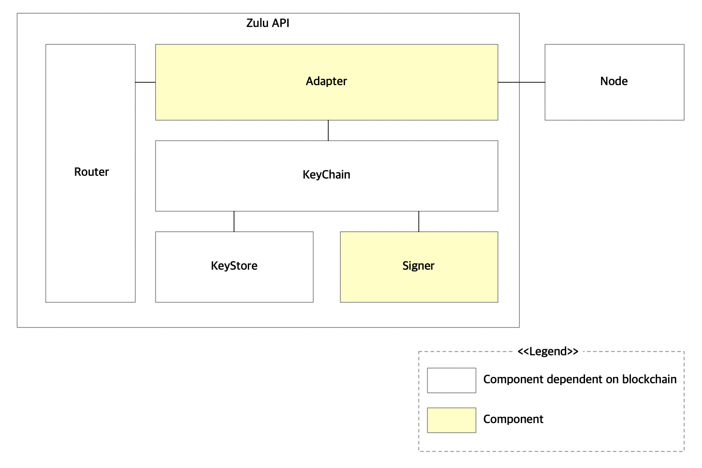

## Architecture




## API

### Network 

- [GET] /networks

  Get the list of supported blockchain networks

  ```
  {
    [
      {
        "id": "988f08b3b21e37269dcc2bbe979c9e69308c1c6b96dc220ce6635a2d728bb31e"
        "blockchain": "bitcoin",
        "network": "mainnet"
      }
    ]
  }
  ```
  
- [GET] /networks/{networkId}

  Get the supported blockchain network by id
  
  ```
  {
    "id": "988f08b3b21e37269dcc"
    "blockchain": "bitcoin",
    "network": "mainnet"
  }
  ```
  
- [GET] /networks/{networkId}/status

  Get the status of supported blockchain network by id
  
  ```
  {
    "block": {
      "index": 1313323,
      "hash": "0x1f2cc6c5027d2f201a5453ad1119574d2aed23a392654742ac3c78783c071f85"
    },
    "peers": [
      {
        "peer_id": "0x52bc44d5378309ee2abf1539bf71de1b7d7be3b5".
        "data": {}
      }
    ]
  }
  ```
  
### Wallet

- [POST] /networks/{networkId}/wallets

  Create a wallet 
  
  ```
  {
    "scheme": "eoa",
    "data": {}
  }
  
  {
    "id": "9dcc988f21e372608b3b"
    "address": "0x3a065000ab4183c6bf581dc1e55a605455fc6d61",
    "balances": [
      {
        "value": "38089899992",
        "decimal": 8,
        "symbol": "BTC"
      }
    ],
    "data": {}
  }
  ```
    
- [GET] /networks/{networkId}/wallets

  Get a wallet
  ```
  {
    "id": "9dcc988f21e372608b3b"
    "address": "0x3a065000ab4183c6bf581dc1e55a605455fc6d61",
    "balances": [
      {
        "value": "38089899992",
        "decimal": 8,
        "symbol": "BTC"
      }
    ],
    "data": {}
  }
  ```
  
- [GET] /networks/{networkId}/wallets

  Get a wallets
  ```
  [
    {
      "id": "9dcc988f21e372608b3b"
      "address": "0x3a065000ab4183c6bf581dc1e55a605455fc6d61",
      "balances": [
        {
          "value": "38089899992",
          "decimal": 8,
          "symbol": "BTC"
        }
      ],
      "data": {}
    }
  ]
  ```

### Transfer

- [POST] /networks/{networkId}/wallets/{walletId}/transfers

  Create a transfer
  ```
  {
    "to": "0x3a065000ab4183c6bf581dc1e55a605455fc6d61",
    "amount": "3"
    "data": {}
  }
  
  {
    "hash": "0x3a065000ab4183c6bf581dc1e55a605455fc6d61",
    "data": {}
  }
  ```